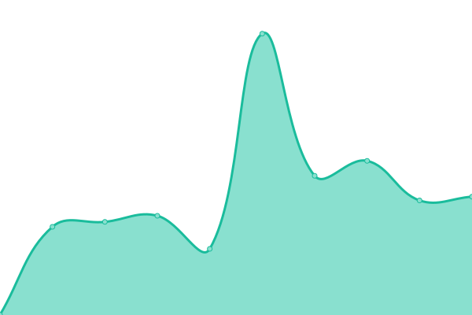
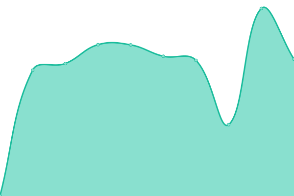

# [📈 Live Status](https://status.protagonist.co.uk): <!--live status--> **🟧 Partial outage**

This repository contains the open-source uptime monitor and status page for [tubul](http://tubul.org), powered by [Upptime](https://github.com/upptime/upptime).

With [Upptime](https://upptime.js.org), you can get your own unlimited and free uptime monitor and status page, powered entirely by a GitHub repository. We use [Issues](https://github.com/tubul/upptime/issues) as incident reports, [Actions](https://github.com/tubul/upptime/actions) as uptime monitors, and [Pages](https://status.protagonist.co.uk) for the status page.

<!--start: status pages-->
<!-- This summary is generated by Upptime (https://github.com/upptime/upptime) -->
<!-- Do not edit this manually, your changes will be overwritten -->
<!-- prettier-ignore -->
| URL | Status | History | Response Time | Uptime |
| --- | ------ | ------- | ------------- | ------ |
|  [Protagonist](https://protagonist.co.uk) | 🟩 Up | [protagonist.yml](https://github.com/tubul/upptime/commits/HEAD/history/protagonist.yml) | 

 530ms
     
 | 

<a href="https://status.protagonist.co.uk/history/protagonist">100.00%</a>
    

|  [Webmail](https://webmail.protagonist.co.uk) | 🟥 Down | [webmail.yml](https://github.com/tubul/upptime/commits/HEAD/history/webmail.yml) | 

 674ms
     
 | 

<a href="https://status.protagonist.co.uk/history/webmail">61.24%</a>
    

|  [Tubul](https://tubul.org) | 🟩 Up | [tubul.yml](https://github.com/tubul/upptime/commits/HEAD/history/tubul.yml) | 

 352ms
     
 | 

<a href="https://status.protagonist.co.uk/history/tubul">100.00%</a>
    

<!--end: status pages-->

[**Visit our status website →**](https://status.protagonist.co.uk)

## 📄 License

- Powered by: [Upptime](https://github.com/upptime/upptime)
- Code: [MIT](./LICENSE) © [tubul](http://tubul.org)
- Data in the `./history` directory: [Open Database License](https://opendatacommons.org/licenses/odbl/1-0/)
